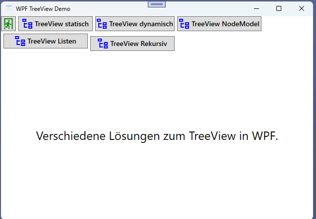

# PWPF TreeView Demo

]

Das Beispiel zeigt verschiedene Lösungen um ein TreeView in WPF darzustellen.

 

Folgende TreeView beispiele sind enthalten:
- Einfaches TreeView mit statischen Daten
    - sowie Icon aus PathGeometry
- TreeView mit dynamischen Daten aus einem Dictionary
    - sowie Icon aus PathGeometry
- TreeView mit dynamischen Daten aus einer Node Model Klasse
    - sowie Icon aus PathGeometry
    - Wechsel des Icon beim Auf- und Zuklappen
    - Auswertung eines Klick auf einen Knoten
    - Kontextmenü auf einen Knoten
- TreeView mit dynamischen Daten auf Basis von Listen je Ebene
    - sowie Icon aus PathGeometry
    - Auswertung eines Klick auf einen Knoten
    - Kontextmenü auf einen Knoten
- Rekursiver Aufbau eines TreeView aus dem Dateisystem
    - sowie Icon aus PathGeometry
    - Auswertung eines Klick auf einen Knoten
    - Kontextmenü auf einen Knoten (kopieren Pfad, öffnen im Explorer)
